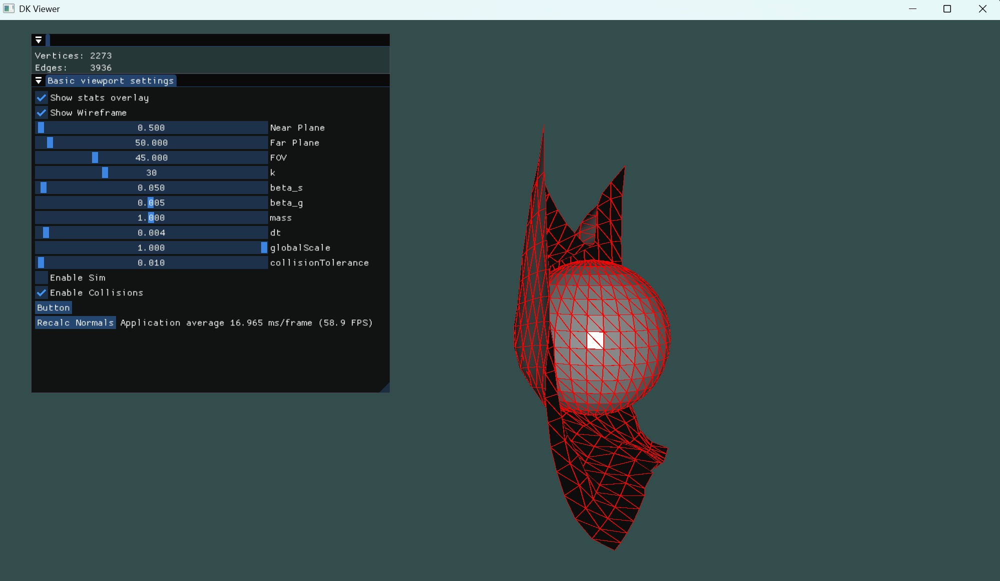

# dkViewer
An OpenGL viewer/engine that will be the basis for viewing all my physics development and graphics experiments.

Current features:
- ImGui UI
- a basic OBJ loader
- a spring based implicit euler cloth solver
- vertex/triangle collision detection

